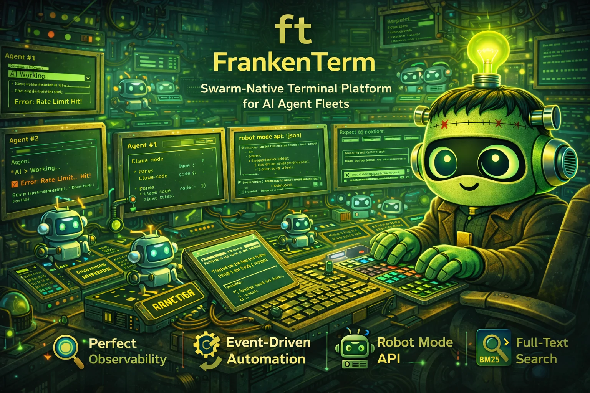

# ft — FrankenTerm

<div align="center">
  
</div>

<div align="center">

[](https://github.com/Dicklesworthstone/frankenterm/actions/workflows/ci.yml)
[](./LICENSE)
[](https://www.rust-lang.org/)
[]()
[]()

</div>

**A swarm-native terminal platform designed to replace legacy terminal workflows for massive AI agent orchestration.** 120 workspace crates. 482 core modules. 45,000+ tests. Built from the ground up for fleets of 200+ concurrent AI coding agents.

<div align="center">
<h3>Quick Install</h3>

```bash
cargo install --git https://github.com/Dicklesworthstone/frankenterm.git ft
```

</div>

---

## TL;DR

**The Problem**: Running large AI coding swarms across ad-hoc terminal panes is chaos. You can't reliably observe state, detect rate limits or auth failures, coordinate handoffs, or automate safe recovery without brittle glue code. When you're running 50+ Claude Code / Codex / Gemini agents simultaneously, a single undetected rate limit wastes hours of compute. A stuck agent silently burns tokens. An auth failure goes unnoticed for 30 minutes. You have no search across agent output, no audit trail, no way for one AI to safely control another.

**The Solution**: `ft` is a **full terminal platform for agent swarms** — with first-class observability, deterministic eventing, policy-gated automation, and machine-native control surfaces (Robot Mode + MCP). It captures every byte of terminal output across every pane, detects state transitions via multi-pattern matching, triggers automated workflows in response, and exposes the entire system through a JSON API designed for AI-to-AI orchestration. Think of it as Kubernetes for terminal-based AI agents: observe, detect, react, audit.

### Platform Direction

`ft` is developed as a replacement-class terminal runtime for multi-agent systems, not a thin wrapper around another terminal. The architecture is actively expanding with:

- Concepts learned from Ghostty and Zellij (session model, ergonomics, and runtime resilience)
- Ground-up `ft` subsystems purpose-built for agent swarms (tiered scrollback, fleet memory, mission orchestration)
- Targeted integrations and code adaptation from `/dp/asupersync`, `/dp/frankensqlite`, and `/frankentui`

### Why Use ft?

| Feature | What It Does |
|---------|--------------|
| **Perfect Observability** | Captures all terminal output across all panes with delta extraction (<50ms lag) |
| **Intelligent Detection** | Multi-agent pattern engine detects rate limits, errors, prompts, completions across Codex, Claude Code, and Gemini |
| **Event-Driven Automation** | Workflows trigger on patterns — no sleep loops or polling heuristics |
| **Robot Mode API** | JSON/TOON interface optimized for AI agents to control other AI agents |
| **Lexical + Hybrid Search** | FTS5 lexical search plus semantic/hybrid retrieval modes across captured output |
| **Policy Engine** | 21-subsystem policy framework with capability gates, rate limiting, audit trails, and approval tokens |
| **Mission Orchestration** | Transactional multi-pane execution with prepare/commit/compensate lifecycle, idempotency guards, and deterministic replay |
| **Tiered Scrollback** | Three-tier memory management (hot/warm/cold) keeps 200+ panes under 1GB vs 4GB+ in stock terminals |
| **Replay & Forensics** | Capture, replay, and diff decision graphs for post-incident analysis and regression testing |
| **Fleet Memory Controller** | Coordinated backpressure across queue depth, system memory, and per-pane budgets with hysteresis |
| **Distributed Mode** | Optional agent-to-aggregator streaming with per-agent dedup, wire protocol versioning, and stale-session pruning |

---

## Quick Example

```bash
# Start the ft watcher/runtime
$ ft watch

# See all active panes as JSON
$ ft robot state
{
  "ok": true,
  "data": {
    "panes": [
      {"pane_id": 0, "title": "claude-code", "domain": "local", "cwd": "/project"},
      {"pane_id": 1, "title": "codex", "domain": "local", "cwd": "/project"}
    ]
  }
}

# Compact TOON output (40-60% fewer tokens for AI-to-AI comms)
$ ft robot --format toon state

# Get recent output from a specific pane
$ ft robot get-text 0 --tail 50

# Batch output from multiple panes in one call
$ ft robot get-text --panes 0,1,2 --tail 20

# Wait for a specific pattern (e.g., agent hitting rate limit)
$ ft robot wait-for 0 "codex.usage.reached" --timeout-secs 3600

# Search all captured output
$ ft robot search "error: compilation failed"

# Semantic/hybrid search mode
$ ft robot search "error: compilation failed" --mode hybrid

# Send input to a pane (with policy checks)
$ ft robot send 1 "/compact"

# View recent detection events
$ ft robot events --limit 10

# Run a transactional multi-pane operation
$ ft tx run --contract mission.json

# Inspect the full tx lifecycle
$ ft tx show --include-contract
```

Read/query interfaces (`ft get-text`, `ft search`, `ft robot get-text`, `ft robot search`, and MCP `wa.get_text` / `wa.search`) are policy-evaluated and redact secret material in returned text/snippets.

---

## Design Philosophy

### 1. Passive-First Architecture

The observation loop (discovery, capture, pattern detection) has **no side effects**. It only reads and stores. The action loop (sending input, running workflows) is strictly separated with explicit policy gates. This means `ft watch` can never accidentally send input to a pane or modify agent state — it is a pure observer.

### 2. Event-Driven, Not Time-Based

No `sleep(5)` loops hoping the agent is ready. Every wait is condition-based: wait for a pattern match, wait for pane idle, wait for an external signal. Deterministic, not probabilistic. The `ft robot wait-for` command exemplifies this — it blocks until a specific rule fires, not until a timer expires.

### 3. Delta Extraction Over Full Capture

Instead of repeatedly capturing entire scrollback buffers, `ft` uses 4KB overlap matching to extract only new content. This produces efficient storage, minimal latency, and explicit gap markers for discontinuities. When the overlap match fails (terminal reset, scrollback clear), the gap is recorded as a first-class event rather than silently dropped.

### 4. Single-Writer Integrity

A file-system lock (via `fs2`) ensures only one watcher can write to the database. No corruption from concurrent mutations. Graceful fallback for read-only introspection. The lock metadata records PID and start time for diagnostics.

### 5. Agent-First Interface

Robot Mode returns structured JSON with consistent schemas. Every response includes `ok`, `data`, `error`, `elapsed_ms`, and `version`. TOON (Token-Optimized Object Notation) output reduces token consumption by 40-60% for AI-to-AI communication. Designed for machines to parse, not humans to read.

### 6. Transactional Safety

Multi-pane operations use a prepare/commit/compensate lifecycle borrowed from distributed transaction protocols. If a commit step fails, compensation rolls back the committed steps. Kill switches and pause controls provide emergency intervention. Every transition emits an observability event with a reason code and decision path.

### 7. Defense in Depth for Memory

The fleet memory controller synthesizes pressure signals from three independent subsystems — pipeline backpressure (queue depths), system memory utilization, and per-pane memory budgets — into a unified 4-tier pressure model (Normal → Elevated → Critical → Emergency) with asymmetric hysteresis (escalate fast, de-escalate slow). Actions range from throttling poll intervals to emergency warm-scrollback eviction.

---

## Safety Guarantees

- **Observe vs act split**: `ft watch` is read-only; mutating actions must pass the Policy Engine.
- **No silent gaps**: capture gaps are recorded explicitly and surfaced in events/diagnostics.
- **Policy-gated sending**: `ft send` and workflows enforce prompt/alt-screen checks, rate limits, and approvals.
- **Policy-gated reads**: `get-text`/`search` surfaces enforce policy checks and return redacted text payloads.
- **Transactional operations**: `ft tx run` uses prepare/commit/compensate phases with idempotency guards and deterministic replay.
- **Approval tokens**: Allow-once approval codes scoped to specific action + pane + fingerprint combinations.
- **Secret redaction**: Captured output is redacted before being returned through any API surface, with configurable sensitivity tiers (T1/T2/T3) and retention policies.

## Secure Distributed Mode

Secure distributed mode is available as an optional feature-gated build and is off by default.

```bash
# Build ft with distributed mode support
cargo build -p frankenterm --release --features distributed
```

The distributed wire protocol provides:
- Versioned message envelopes with sender identity validation
- Per-agent sequence-number dedup (no duplicate processing)
- 1 MiB maximum message size enforcement
- Stale-session pruning with configurable idle thresholds
- Local receipt-clock decisions (untrusted remote clocks not used for liveness)

Operator guidance:
- Keep `distributed.bind_addr` on loopback unless you explicitly need remote access.
- For non-loopback binds, enable TLS and use file/env token sources (avoid inline tokens).
- Use `ft doctor` (or `ft doctor --json`) to verify effective distributed security status.
- Follow `docs/distributed-security-spec.md` for setup, rotation, and troubleshooting.

---

## How ft Compares

| Feature | ft | WezTerm | Zellij | Ghostty |
|---------|----|---------|--------|---------|
| Swarm-native orchestration | First-class (200+ panes) | External glue required | External glue required | External glue required |
| Event-driven automation | Built-in workflows + policy gate | Not native | Not native | Not native |
| Machine API for agents | Robot Mode + MCP + TOON | No equivalent | No equivalent | No equivalent |
| Cross-session state + recovery | Built-in snapshots/sessions | Partial/manual | Session-centric, not swarm-centric | Minimal |
| Agent-safe control plane | 21-subsystem policy engine | Not native | Not native | Not native |
| Transactional multi-pane ops | Prepare/commit/compensate | No equivalent | No equivalent | No equivalent |
| Full-text search over output | FTS5 + semantic/hybrid modes | No equivalent | No equivalent | No equivalent |
| Memory management at scale | Three-tier scrollback + fleet controller | Single tier | Single tier | Single tier |
| Replay and forensics | Decision graph + diff + provenance | No equivalent | No equivalent | No equivalent |
| Backend extensibility | Explicit platform direction | Terminal app only | Terminal app only | Terminal app only |

**When to use ft:**
- Running 2+ AI coding agents that need coordination
- Building automation that reacts to terminal output
- Debugging multi-agent workflows with full observability
- Operating large agent swarms (50-200+ panes) with memory and backpressure control

**When ft might not be ideal:**
- Single shell/single-agent usage where orchestration is unnecessary
- Environments that only need a lightweight interactive terminal and no swarm control plane

---

## Installation

### Via Cargo (Fastest)

```bash
cargo install --git https://github.com/Dicklesworthstone/frankenterm.git ft
```

### From Source

```bash
# Clone and build
git clone https://github.com/Dicklesworthstone/frankenterm.git
cd frankenterm
cargo build --release

# Install to PATH
cp target/release/ft ~/.local/bin/
```

### With Optional Features

```bash
# MCP server support
cargo build -p frankenterm --release --features mcp

# Distributed mode (agent streaming)
cargo build -p frankenterm --release --features distributed

# Semantic search (ML embeddings)
cargo build -p frankenterm --release --features semantic-search

# TUI dashboard
cargo build -p frankenterm --release --features tui

# Everything
cargo build -p frankenterm --release --all-features
```

### Requirements

- **Rust nightly** (Rust 2024 edition — see `rust-toolchain.toml`)
- **Compatibility backend bridge (current):** WezTerm CLI available for existing pane/session interop while native runtime coverage expands
- **SQLite** (bundled via rusqlite — no system dependency)

---

## Quick Start

### 1. Run Setup (recommended)

```bash
# Guided setup (generates config snippets and shell hooks)
ft setup

# Bundled Pragmasevka Nerd Font auto-installs on normal ft usage
# (no `ft setup font --apply` required), and generated wezterm config
# defaults to it automatically.

# Manual install / reinstall path:
ft setup font --apply

# Opt out of automatic font install for this invocation:
FT_SKIP_BUNDLED_FONT_INSTALL=1 ft status
```

### 2. Verify Terminal Backend Connectivity

```bash
# Compatibility backend check (current migration path)
wezterm cli list
```

### 3. Start the Watcher

```bash
# Start observing all panes
ft watch

# Or run in foreground for debugging
ft -v watch --foreground
```

### 4. Check Status

```bash
# See what ft is observing
ft status

# Robot mode for JSON output
ft robot state
```

### 5. Search Captured Output

```bash
# Full-text search across all panes (alias: `ft query`)
ft search "error"
ft query "error"

# Events feed (recent detections)
ft events

# Annotate/triage events
ft events annotate 123 --note "Investigating"
ft events triage 123 --state investigating
ft events label 123 --add urgent

# Robot mode with structured results
ft robot search "compilation failed" --limit 20
```

### 6. React to Events

```bash
# Wait for an agent to hit its rate limit
ft robot wait-for 0 "codex.usage.reached"

# Then send a command to handle it
ft robot send 0 "/compact"
```

---

## Commands

### Watcher Management

```bash
ft watch                     # Start watcher in background
ft watch --foreground        # Run in foreground
ft watch --auto-handle       # Enable auto workflows
ft stop                      # Stop running watcher
```

### Pane Inspection

```bash
ft status                    # Overview of observed panes
ft show <pane_id>           # Detailed pane info
ft get-text <pane_id>       # Recent output from pane
```

### Pane Actions

```bash
ft send <pane_id> "<text>"                 # Send input (policy-gated)
ft send <pane_id> "<text>" --dry-run       # Preview without executing
ft send <pane_id> "<text>" --wait-for "ok" # Verify via wait-for
ft send <pane_id> "<text>" --no-paste --no-newline
```

### Search

```bash
ft search "<query>"          # Full-text search
ft search "<query>" --pane 0 # Scope to specific pane
ft search "<query>" --limit 50
```

### Explainability

```bash
ft why --list                # List available explanation templates
ft why deny.alt_screen       # Explain a common policy denial
```

### Workflows

```bash
ft workflow list                         # List available workflows
ft workflow run handle_usage_limits --pane 0
ft workflow run handle_usage_limits --pane 0 --dry-run
ft workflow status <execution_id> -v
```

### Mission & Tx Control

```bash
ft mission plan                         # Validate mission contract and compute hash
ft mission status                       # Show lifecycle and assignment summary
ft tx plan                              # Validate tx contract and summarize lifecycle
ft tx run                               # Execute prepare+commit deterministically
ft tx run --fail-step tx-step:2         # Inject a deterministic commit failure
ft tx rollback                          # Execute compensation for committed steps
ft tx show --include-contract           # Inspect receipts and full tx payload
```

### Rules

```bash
ft rules list                            # List detection rules
ft rules test "Usage limit reached"      # Test text against rules
ft rules show codex.usage_reached        # Show rule details
```

### Audit & Approvals

```bash
ft approve AB12CD34 --dry-run            # Check approval status
ft audit --limit 50 --pane 3             # Filter audit history
ft audit --decision deny                 # Only denied decisions
```

### Diagnostics

```bash
ft triage                               # Summarize issues (health/crashes/events)
ft diag bundle --output /tmp/ft-diag    # Collect diagnostic bundle
ft reproduce --kind crash               # Export latest crash bundle
ft doctor                               # Environment health check
ft doctor --json                        # Machine-readable diagnostics
```

### Robot Mode (JSON API)

Use `--format toon` for token-efficient output and `ft robot help` for the full command list.

```bash
ft robot state               # All panes as JSON
ft robot state --include-text --tail 20  # Pane metadata + per-pane tail output
ft robot get-text <id> --tail 50      # Single pane output as JSON
ft robot get-text --panes 0,1,2 --tail 20  # Batch pane output in one call
ft robot get-text --all --tail 10     # Batch all active panes in one call
ft robot send <id> "<text>" # Send input (with policy)
ft robot send <id> "<text>" --dry-run  # Preview without executing
ft robot wait-for <id> <rule_id>       # Wait for pattern
ft robot search "<query>" --mode <lexical|semantic|hybrid>  # Structured search
ft robot events             # Recent detection events
ft robot help               # List all robot commands
```

### MCP (Model Context Protocol)

```bash
# Build with MCP feature enabled
cargo build --release --features mcp

# Start MCP server over stdio
ft mcp serve
```

MCP mirrors robot mode. See `docs/mcp-api-spec.md` for the tool list and `docs/json-schema/` for response schemas.
For multi-agent operating procedures, see `docs/swarm-playbook.md`.

### Session Persistence

```bash
ft snapshot save             # Capture current mux state
ft snapshot list             # List recent snapshots
ft snapshot inspect <id>     # Inspect snapshot contents
ft snapshot diff <id1> <id2> # Compare two snapshots
ft session list              # List saved sessions
ft session show <session_id> # Show session + checkpoints
ft session doctor            # Health check for session persistence
```

### Configuration

```bash
ft config show               # Display current config
ft config validate           # Check config syntax
ft config reload             # Hot-reload config (SIGHUP)
```

For the full command matrix (human + robot + MCP), see `docs/cli-reference.md`.
For GUI onboarding and WezTerm migration, see `docs/frankenterm-gui-user-guide.md`.

---

## Configuration

Configuration lives in `~/.config/ft/ft.toml`:

```toml
[general]
# Logging level: trace, debug, info, warn, error
log_level = "info"
# Output format: pretty (human) or json (machine)
log_format = "pretty"
# Data directory for database and locks
data_dir = "~/.local/share/ft"

[ingest]
# How often to poll panes for new content (milliseconds)
poll_interval_ms = 200
# Filter which panes to observe
[ingest.panes]
include = []  # Empty = all panes
exclude = ["*htop*", "*vim*"]  # Glob patterns

# Pane priority overrides (lower number = higher priority)
[ingest.priorities]
default_priority = 100

[[ingest.priorities.rules]]
id = "critical_codex"
priority = 10
title = "codex"

[[ingest.priorities.rules]]
id = "deprioritize_ssh"
priority = 200
domain = "SSH:*"

# Capture budgets (0 = unlimited)
[ingest.budgets]
max_captures_per_sec = 0
max_bytes_per_sec = 0

[storage]
# Write queue size for batched inserts
writer_queue_size = 100
# How long to retain captured output
retention_days = 30

[vendored]
# Optional explicit socket for single-backend mux access
mux_socket_path = "~/.local/share/wezterm/default.sock"

[vendored.mux_pool]
# Connection pool tuning for direct mux RPC
max_connections = 64
idle_timeout_seconds = 60
acquire_timeout_seconds = 10
pipeline_depth = 32
pipeline_timeout_ms = 5000
compression = "auto"

[vendored.sharding]
# Multi-socket sharding mode (requires 2+ socket_paths when enabled)
enabled = false
socket_paths = ["/tmp/ft-shard-0.sock", "/tmp/ft-shard-1.sock"]
# Assignment strategy tag: round_robin | by_domain | by_agent_type | manual | consistent_hash
assignment = { strategy = "round_robin" }

[backup.scheduled]
# Enable scheduled backups
enabled = false
# Schedule: hourly, daily, weekly, or 5-field cron
schedule = "daily"
# Retention policy
retention_days = 30
max_backups = 10
# Optional destination root
destination = "~/.local/share/ft/backups"

[patterns]
# Which detection packs to enable
packs = ["core"]
# Core pack detects: Claude Code, Codex, Gemini state transitions

[workflows]
# Enable automatic workflow execution on pattern matches
enabled = true
# Maximum concurrent workflows
concurrency = 10

[safety]
# Require approval for actions on new hosts
approve_new_hosts = true
# Redact sensitive patterns (API keys, tokens) in logs
redact_secrets = true
# Rate limits per action type
[safety.rate_limits]
send_text = { max_per_second = 2 }

[agent_detection]
# Agent pane state detection thresholds (milliseconds)
enabled = true
active_output_threshold_ms = 5000    # Output within 5s → Active (green)
thinking_silence_ms = 5000           # Input sent, no output for 5s → Thinking (yellow)
stuck_silence_ms = 30000             # No output for 30s after input → Stuck (red)
idle_silence_ms = 60000              # No activity for 60s → Idle (gray)
```

### Environment Variables

| Variable | Purpose |
|----------|---------|
| `FT_OUTPUT_FORMAT` | Default format (`json` or `toon`) |
| `TOON_DEFAULT_FORMAT` | Fallback default format |
| `FT_WORKSPACE` | Workspace root directory |
| `FT_SKIP_BUNDLED_FONT_INSTALL` | Skip automatic font install |

---

## Architecture

```
┌─────────────────────────────────────────────────────────────────────────┐
│                         ft Swarm Runtime Core                           │
│   Session Graph │ Pane Registry │ State Store │ Control Plane          │
│   Mission Orchestrator │ Fleet Memory Controller │ Tx Engine           │
└─────────────────────────────────────────────────────────────────────────┘
                                   │
                    Backend Adapters + Runtime Integrations
                                   ▼
┌─────────────────────────────────────────────────────────────────────────┐
│                      Ingest + Normalization Pipeline                     │
│   Discovery → Delta Extraction → Fingerprinting → Observation Filter    │
│   SIMD Scan → Pattern Trigger → zstd Compression                       │
└─────────────────────────────────────────────────────────────────────────┘
                                   │
                                   ▼
┌─────────────────────────────────────────────────────────────────────────┐
│                    Storage Layer (SQLite + FTS5 + Tantivy)              │
│   output_segments │ events │ workflow_executions │ audit_actions        │
│   approval_tokens │ session_checkpoints │ mux_pane_state              │
└─────────────────────────────────────────────────────────────────────────┘
                                   │
                    ┌──────────────┼──────────────┐
                    ▼              ▼              ▼
             ┌───────────┐  ┌───────────┐  ┌───────────┐
             │  Pattern  │  │   Event   │  │  Workflow │
             │  Engine   │  │    Bus    │  │  Engine   │
             │ (detect)  │  │ (fanout)  │  │ (execute) │
             └───────────┘  └───────────┘  └───────────┘
                    │              │              │
                    └──────────────┼──────────────┘
                                   ▼
┌─────────────────────────────────────────────────────────────────────────┐
│                         Policy Engine (21 subsystems)                    │
│   Capability Gates │ Rate Limiting │ Audit Trail │ Approval Tokens      │
│   Secret Redaction │ Backpressure Tiers │ Circuit Breakers             │
└─────────────────────────────────────────────────────────────────────────┘
                                   │
                    ┌──────────────┼──────────────┐
                    ▼              ▼              ▼
┌──────────────────────┐ ┌──────────────┐ ┌───────────────────────┐
│   Robot Mode API     │ │  MCP Server  │ │  Distributed Streamer │
│   JSON / TOON        │ │  (stdio)     │ │  (wire protocol)      │
└──────────────────────┘ └──────────────┘ └───────────────────────┘
```

### Workspace Structure

```
frankenterm/                              # 120 workspace crates
├── crates/
│   ├── frankenterm/                      # CLI binary (ft) — 53k lines
│   ├── frankenterm-core/                 # Core library — 482 modules, 775k lines
│   │   ├── src/
│   │   │   ├── runtime.rs               # Observation runtime orchestration
│   │   │   ├── ingest.rs                # Pane discovery + delta extraction
│   │   │   ├── patterns.rs              # Pattern detection engine
│   │   │   ├── events.rs                # Event bus and detection fanout
│   │   │   ├── storage.rs               # SQLite + FTS5
│   │   │   ├── policy.rs                # Safety/access control (8 modules)
│   │   │   ├── plan.rs                  # Mission + Tx types
│   │   │   ├── workflows/               # Workflow engine + handlers
│   │   │   ├── search/                  # Search subsystem (28 modules)
│   │   │   ├── replay_*.rs              # Replay/forensics (27 modules)
│   │   │   ├── connector_*.rs           # Connector fabric (14 modules)
│   │   │   ├── tx_*.rs                  # Transaction subsystem
│   │   │   ├── scrollback_tiers.rs      # Three-tier scrollback storage
│   │   │   ├── fleet_memory_controller.rs # Fleet memory orchestration
│   │   │   ├── scan_pipeline.rs         # SIMD scan + trigger + compression
│   │   │   ├── wire_protocol.rs         # Distributed messaging
│   │   │   └── ...                      # 400+ additional modules
│   │   ├── tests/                       # 696 test files, 496 proptest suites
│   │   └── benches/                     # 62 Criterion benchmarks
│   ├── frankenterm-gui/                  # GUI binary crate
│   ├── frankenterm-mux-server/           # Headless mux server
│   └── frankenterm-alloc/                # Allocator/telemetry support
├── frankenterm/                          # In-tree vendored crates (105 crates)
│   ├── codec/                           # Wire codec
│   ├── config/                          # Config subsystem
│   ├── mux/                             # Multiplexer
│   ├── pty/                             # PTY layer
│   ├── term/                            # Terminal emulator
│   ├── termwiz/                         # Terminal primitives
│   └── ...                              # Additional subsystem crates
├── fuzz/                                 # 4 fuzzing targets
├── docs/                                 # 114 documentation files
├── tests/e2e/                            # 149 end-to-end test harnesses
└── fixtures/                             # Test fixtures
```

### Key Algorithms and Techniques

| Subsystem | Algorithm / Technique | Purpose |
|-----------|----------------------|---------|
| Delta extraction | 4KB overlap matching with gap semantics | Efficient incremental capture without full-buffer re-reads |
| Pattern detection | Aho-Corasick multi-pattern + anchor filtering + Bloom pre-filter | Fast multi-agent pattern matching with probabilistic pre-rejection |
| Scan pipeline | SIMD newline/ANSI density scan + batch trigger + zstd compression | Three-stage processing pipeline for raw pane output |
| Search | FTS5 lexical + Tantivy + optional ML embeddings | Multi-mode search (lexical, semantic, hybrid) |
| Backpressure | Four-tier model (Green/Yellow/Red/Black) with queue-depth gauges | Prevent OOM and cascading latency under load |
| Fleet memory | Worst-of tier synthesis with asymmetric hysteresis | Coordinated pressure response across 200+ panes |
| Scrollback | Hot (RAM) → Warm (zstd compressed) → Cold (evicted) tiering | Memory-efficient scrollback for large pane counts |
| Tx execution | Prepare/commit/compensate with idempotency ledger | Safe multi-pane transactional operations |
| Retry | Exponential backoff with jitter + circuit breaker integration | Robust I/O error handling without retry storms |
| Rate monitoring | Time-bucketed sliding window counters | Throughput monitoring and burst detection |
| Latency analysis | Min-plus algebra (network calculus) | Formal worst-case delay and backlog bounds |
| Graph analysis | Dijkstra + Bellman-Ford + Floyd-Warshall | Agent routing and dependency chain analysis |
| Decision replay | Normalized DAG + causal edges + diff engine | Post-incident forensics and regression testing |
| Content dedup | SHA-256 content hashing + FNV-1a fast hash | Prevent duplicate indexing in search pipeline |
| Quiescence detection | Composable gauge + activity tracker with atomic CAS | Wait for system to settle before taking action |

### Data Flow

1. **Discovery**: Enumerate pane/session resources via active backend adapters
2. **Capture**: Stream output and state deltas from adapters/runtime hooks
3. **Delta**: Compare with previous capture using 4KB overlap matching
4. **Scan**: Run three-stage pipeline (SIMD metrics → pattern trigger → compression)
5. **Store**: Append new segments to SQLite with FTS5 indexing
6. **Detect**: Run pattern engine against new content
7. **Event**: Broadcast detections to event bus subscribers
8. **Workflow**: Execute registered workflows on matching events
9. **Policy**: Gate all actions through capability and rate limit checks
10. **API**: Expose everything via Robot Mode JSON interface + MCP

---

## Pattern Detection

`ft` detects state transitions across multiple AI coding agents:

| Agent | Pattern Examples |
|-------|------------------|
| **Codex** | `codex.usage.reached`, `codex.rate_limit.detected`, `codex.session.end` |
| **Claude Code** | `claude_code.usage.reached`, `claude_code.approval_needed`, `claude_code.session.end` |
| **Gemini** | `gemini.usage.reached`, `gemini.rate_limit.detected` |
| **Terminal Runtime** | `wezterm.mux.connection_lost`, `wezterm.pane.exited` |

### Pattern IDs

Every detection has a stable `rule_id` like `codex.usage.reached`. Use these in:
- `ft robot wait-for <pane_id> <rule_id>` — wait for specific condition
- Workflow triggers — automatically react to patterns
- Allowlists — suppress false positives
- `ft rules test "text"` — validate patterns against sample text

### Agent Pane State Detection

Beyond pattern matching, `ft` continuously classifies each agent pane into a visual state:

| State | Color | Condition |
|-------|-------|-----------|
| **Active** | Green | Output received within 5 seconds |
| **Thinking** | Yellow | Input sent, no output for 5-30 seconds |
| **Stuck** | Red | No output for 30+ seconds after input, or flagged by watchdog |
| **Idle** | Gray | No input or output for 60+ seconds |
| **Human** | Default | Pane is not agent-controlled |

These states drive GUI pane border colors and enable mass operations like "kill all stuck agents."

---

## Performance Benchmarks

Benchmarks live under `crates/frankenterm-core/benches/` (62 Criterion benchmarks) and use human-readable budgets with machine-readable artifacts.

```bash
# Compile benches (fast sanity check)
cargo bench -p frankenterm-core --benches --no-run

# Run a specific bench
cargo bench -p frankenterm-core --bench pattern_detection
cargo bench -p frankenterm-core --bench delta_extraction
cargo bench -p frankenterm-core --bench fts_query
```

When a bench runs, it prints a `[BENCH] {...}` metadata line and writes:
- `target/criterion/ft-bench-meta.jsonl` (budgets + environment)
- `target/criterion/ft-bench-manifest-<bench>.json` (artifact manifest)

### Performance Targets

| Operation | Target | Notes |
|-----------|--------|-------|
| Delta capture latency | <50ms | 4KB overlap matching |
| Pattern detection | <1ms per rule pack | Bloom filter pre-rejection |
| FTS5 query | <10ms | SQLite full-text search |
| Robot Mode response | <5ms | JSON envelope generation |
| Context snapshot | <100us | Per-event environment capture |
| Memory per pane (hot) | ~200 bytes/line | Uncompressed in VecDeque |
| Memory per pane (warm) | ~40 bytes/line | 5:1 zstd compression |

---

## Testing

The project maintains extensive test coverage:

| Category | Count | Purpose |
|----------|-------|---------|
| Lib unit tests | ~22,000 | Module-level correctness |
| Property tests (proptest) | ~500 suites | Serde roundtrip, invariants, fuzzing |
| Integration tests | ~700 files | Cross-module behavior |
| E2E test harnesses | 149 scripts | Full-pipeline validation |
| Criterion benchmarks | 62 | Performance regression detection |
| Fuzz targets | 4 | Security/robustness |

```bash
# Run all tests
cargo test --workspace

# Run core library tests
cargo test -p frankenterm-core --lib

# Run with specific features
cargo test -p frankenterm-core --features subprocess-bridge

# Run property tests
cargo test -p frankenterm-core --test 'proptest_*'
```

---

## Troubleshooting

For a step-by-step operator guide (triage → why → reproduce), see `docs/operator-playbook.md`.

### Compatibility backend returns empty pane list

```bash
# Ensure compatibility backend is up
wezterm start --always-new-process
```

### Daemon won't start: "watcher lock held"

Another `ft` watcher is already running.

```bash
# Check for existing watcher
ft status

# Force stop if stuck
ft stop --force

# Or remove stale lock
rm ~/.local/share/ft/watcher.lock
```

### High memory usage

Delta extraction may be failing, falling back to full captures. Or too many panes are accumulating warm scrollback.

```bash
# Check for gaps in capture
ft robot events --event-type gap

# Reduce poll interval
# In ft.toml:
[ingest]
poll_interval_ms = 500  # Slower polling
```

### Pattern not detecting

```bash
# Enable debug logging
ft -vv watch --foreground

# Test pattern manually
ft rules test "Usage limit reached. Try again later."

# List all active rules
ft rules list --verbose
```

### Robot mode returns errors

```bash
# Check watcher is running
ft status

# Verify pane exists
ft robot state

# Compatibility backend sanity check
wezterm cli list

# Check policy blocks
ft robot send 0 "test" --dry-run
```

### Transaction failures

```bash
# Validate the contract before running
ft tx plan --contract mission.json

# Run with failure injection to test compensation
ft tx run --fail-step tx-step:2

# Inspect what happened
ft tx show --include-contract
```

---

## Limitations

### What ft Doesn't Do (Yet)

- **Complete backend independence**: Compatibility bridge still leans on WezTerm in current builds.
- **Unified UX parity across all target backends**: Active migration area.
- **GUI interaction**: Core focus is terminal/state orchestration, not arbitrary GUI automation.
- **Production-grade multi-host federation**: Distributed mode exists, but hardening is still ongoing.

### Known Limitations

| Capability | Current State | Planned |
|------------|---------------|---------|
| Backend decoupling from compatibility bridge | In progress | Ongoing |
| Browser automation (OAuth) | Feature-gated, partial | v0.2+ |
| MCP server integration | Feature-gated (stdio) | v0.2+ |
| Web dashboard | Feature-gated (health-only) | v0.3+ |
| Multi-host federation | Early distributed mode | v2.0+ |
| Semantic search | Feature-gated (requires ML embeddings) | v0.2+ |

---

## FAQ

### Why "ft"?

**F**ranken**T**erm. Short, typeable, memorable.

### Is my terminal output stored permanently?

By default, output is retained for 30 days (configurable via `storage.retention_days`). Data is stored locally in SQLite at `~/.local/share/ft/ft.db`. Backup and restore is supported via `ft backup export` / `ft backup import`.

### Does ft send data anywhere?

Default mode is local-first: no telemetry and no cloud dependency. Network activity only occurs when you explicitly enable integrations like webhooks, SMTP email alerts, or distributed mode.

### Can I use ft without running AI agents?

Yes. The pattern detection and search work for any terminal output. Useful for debugging, auditing, or building custom automation.

### How do I add custom patterns?

Edit `~/.config/ft/patterns.toml`:

```toml
[[patterns]]
id = "custom:my_error"
pattern = "FATAL ERROR:.*"
severity = "critical"
```

Then validate with:

```bash
ft rules test "FATAL ERROR: database connection lost"
```

### What's the performance overhead?

- **CPU**: <1% during idle; brief spikes during pattern detection
- **Memory**: ~50MB for watcher with 100 panes (with tiered scrollback); ~200MB for 200 panes
- **Disk**: ~10MB/day for typical multi-agent usage (compressed deltas)
- **Latency**: <50ms average capture lag

### How does the transaction system work?

`ft tx` implements a prepare/commit/compensate lifecycle:

1. **Prepare**: Validate preconditions (policy checks, pane liveness, reservations)
2. **Commit**: Execute steps in dependency order with per-step receipts
3. **Compensate**: If any commit step fails, undo committed steps in reverse order

Each phase emits observability events with reason codes, and the entire execution is recorded in an idempotency ledger for safe resume after crashes.

### How does tiered scrollback save memory?

For 200 panes, stock terminal emulators keep all scrollback uncompressed in RAM (~4GB+). `ft` organizes scrollback into three tiers:

| Tier | Storage | Access | Memory per 1000 lines |
|------|---------|--------|----------------------|
| **Hot** | VecDeque (RAM) | Instant | ~200KB |
| **Warm** | zstd compressed (RAM) | Decompress on demand | ~40KB |
| **Cold** | Evicted (re-fetch from SQLite) | Query on demand | 0KB |

With default settings (1000 hot lines, 50MB warm cap per pane), 200 panes fit in under 1GB.

### What agents does ft detect?

Currently: **Codex** (OpenAI), **Claude Code** (Anthropic), **Gemini** (Google), and terminal runtime events. Custom patterns can detect any agent or application.

---

## About Contributions

Please don't take this the wrong way, but I do not accept outside contributions for any of my projects. I simply don't have the mental bandwidth to review anything, and it's my name on the thing, so I'm responsible for any problems it causes; thus, the risk-reward is highly asymmetric from my perspective. I'd also have to worry about other "stakeholders," which seems unwise for tools I mostly make for myself for free. Feel free to submit issues, and even PRs if you want to illustrate a proposed fix, but know I won't merge them directly. Instead, I'll have Claude or Codex review submissions via `gh` and independently decide whether and how to address them. Bug reports in particular are welcome. Sorry if this offends, but I want to avoid wasted time and hurt feelings. I understand this isn't in sync with the prevailing open-source ethos that seeks community contributions, but it's the only way I can move at this velocity and keep my sanity.

---

## License

MIT License (with OpenAI/Anthropic Rider). See [LICENSE](LICENSE) for details.

---

<div align="center">

**Built to be the terminal runtime for the AI agent age.**

*120 crates. 482 modules. 775,000 lines. 45,000 tests. One mission: make AI agent swarms observable, controllable, and safe.*

</div>
